Análisis de Discriminación Salarial en una Universidad con un Enfoque
Bayesiano
================
José Andrés Germán Parra
01-06-2022


# 1 RESUMEN

En este proyecto se abordó el tema de la discriminación salarial en una
universidad, donde el objetivo principal fue determinar si las mujeres
son discriminadas de esta forma, ya que los datos obtenidos se
presentaron en procedimientos judiciales. Al inicio se utilizó un
análisis gráfico, después se planteó utilizar regresión lineal múltiple
con un enfoque bayeasiano para probar con un nivel de confiabilidad la
existencia de discriminación salarial, y la opinión de un especialista
en el tema se tomó en cuenta en una parte del desarrollo del proyecto.
Se concluyó que no existe discriminación salarial hacia las mujeres.

**Palabras** **clave**: Discriminación salarial, sexo, variable dummy,
regresión lineal, intervalo de credibilidad, prueba de hipótesis.

# 2 INTRODUCCIÓN

Según la *U.S. Equal Employment Opportunity Commission*, la
discriminación basada en el sexo implica tratar a alguien de manera
desfavorable debido al sexo, un caso particular es la discriminación
salarial basada en el sexo. En una denuncia por discrimiación salarial
por sexo, para el responsable de dar un dictamen, sería útil tener
disponible un pequeño estudio que utiliza datos obtenidos en el lugar
correspondiente, para este caso se utiliza regresión lineal múltiple con
un enfoque bayesiano.

En el libro *Applied Linear Regression* se menciona el problema, los
datos que se tienen se refieren al salario y otras características de
todos los profesores de una pequeña universidad del Medio Oeste de
Estados Unidos, recopiladas a principios de la década de 1980 para su
presentación en procedimientos judiciales por los que se denunciaba
discriminación salarial contra las mujeres. No se incluyen datos de
personas que tengan facultad temporal. Las variables incluyen degree, un
factor con niveles de PhD y MS; rank, un factor con niveles Asst, Assoc
y Prof; sex, factor con niveles Male y Female; Year, años en rango
actual; ysdeg, años desde el grado superior y salary, salario del año
académico en dólares.

Schultz (1961) dice que dos de las categorías que se toman en cuenta
para examinar la inversión humana son el entrenamiento sobre el trabajo
y nivel de educación que tiene la persona, por lo que el grado de
estudios, los años que lleva en ese grado y los años en el rango actual
se usarán para ajustar algunos modelos.

# 3 JUSTIFICACIÓN

En este proyecto se utiliza como herramienta lo aprendido en el curso de
Introducción a la Estadística Bayesiana, y en particular se ajustan
modelos de regresión lineal múltiple, y se hace una conclusión sobre la
existencia de discriminación salarial apoyándose en pruebas de hipótesis
sobre algunos parámetros, los cuales tienen una interpretación en el
problema.

# 4 OBJETIVOS

Se pretende determinar si existe el problema de discriminación salarial
hacia las mujeres en la univerisidad de donde se obtuvieron los datos. Y
se ajustan varios modelos utilizando un enfoque bayesiano, donde se verá
si son congruentes sobre la prueba de la hipótesis de existencia de
discriminación salarial hacia las mujeres.

# 5 MATERIALES Y MÉTODOS

## 5.1 Modelo de Regresión Lineal Múltiple

Para explicar el comportamiento de la respuesta $y=\log$(salario), que
se asume que se distribuye normalmente, se utiliza el modelo de
regresión lineal múltiple

$$y=\beta_0+ \beta_1x_1+\beta_2x_2+\cdots +\beta_kx_k+\varepsilon, ~~\varepsilon \sim N_n(0,~ \sigma^2 \pmb{I}),$$

donde las covariables $x:=(x_1,~x_2,\ldots,x_k)$ serán determinadas por
pruebas de hipótesis, y después también se toma en consideración lo que
un especialista dice. La variable a la que más se le presta atención es
una variable $dummy$ que determina el sexo de una persona, ya que si
resulta no ser significativa para el modelo se tendrá una conclusión que
niega o nó lo que se denuncia con un nivel de confianza dado
(dependiendo de cómo se defina esta variable).

## 5.2 Distribución Muestral

Dados los datos $y$, se tiene que la distribución de muestreo está dada
por

$$  l(\pmb{\beta},~\sigma^2|y)=\frac{1}{(2\pi)^{n/2}(\sigma^2)^{n/2}}\exp \left[ -\frac{1}{2\sigma^{2}}(y- X \beta)^t(y-X \beta ) \right].$$

## 5.3 Distribución a Priori de los Parámetros

Se asume una distribución a priori no informativa para los parámetros,
ya que no se cuenta con información,

$$\pi(\pmb{\beta},~\sigma^2) \propto \frac{1}{\sigma^2}.$$

## 5.4 Distribuciones Condicionales a Posteriori

Se derivan las distribuciones condicionales de los parámetros (esto se
hizo en clase). Para $\pmb{\beta}$, se puede mostrar que

$$(y-X \pmb{\beta})^t(y-X \pmb{\beta})=\nu s^2+ (\pmb{\beta}-\hat{\pmb{\beta}}_{OLS})^t(X^tX)(\pmb{\beta}-\hat{\pmb{\beta}}_{OLS}),~~ \nu=n- \# \mbox{columnas de }X~\mbox{y}~s^2=\hat{\sigma}_{OLS}^2.$$
Entonces, para la distribución a posteriori condicional de $\pmb{\beta}$
dados $\sigma^2$ y $y$

$$\begin{align*}
\pi(\pmb{\beta},~\sigma^2|y) & \propto l(\pmb{\beta},~\sigma^2|y)\pi(\pmb{\beta},~\sigma^2) \\
& \propto \frac{1}{(2\pi)^{n/2}(\sigma^2)^{n/2}}\exp \left[ -\frac{1}{2} \left( \frac{\nu s^2}{\sigma^2}+ (\pmb{\beta}-\hat{\pmb{\beta}}_{OLS})^t \frac{1}{\sigma^2}(X^tX)(\pmb{\beta}-\hat{\pmb{\beta}}_{OLS}) \right) \right] \cdot \frac{1}{\sigma^2} 
\end{align*}$$

$$\begin{align*}
\Rightarrow & \pi(\pmb{\beta}|y,~\sigma^2) \propto \frac{1}{(\sigma^2)^{n/2+1}}\exp \left[ -\frac{1}{2} \left( \frac{\nu s^2}{\sigma^2}+ (\pmb{\beta}-\hat{\pmb{\beta}}_{OLS})^t (\sigma^2(X^tX)^{-1})^{-1}(\pmb{\beta}-\hat{\pmb{\beta}}_{OLS}) \right) \right] \\
 \Rightarrow & \pmb{\beta}|y,~\sigma^2 \sim N_{k+1}(\hat{\pmb{\beta}}_{OLS}, ~\sigma^2 (X^tX)^{-1}) 
 \end{align*}.$$ Y para la distribución a posteriori condicional de
$\sigma^2$ dados $\pmb{\beta}$ y $y$

$$\pi(\sigma^2|y, ~\pmb{\beta}) \propto (\sigma^2)^{-\left( \frac{n}{2}-1 \right)} \exp \left[ -\frac{1}{2} (y- X \beta)^t\frac{1}{\sigma^2} (y- X \beta)\right].$$
El kernel de una distribución $\chi^2_k$, dado que $X=x$, es
$x^{\frac{k}{2}-1}e^{-\frac{x}{2}}$, y sean
$d:=(y-X\pmb{\beta})^t(y-X\pmb{\beta})$ y $z=\sigma^2$, luego

$$f_Z(z) \propto  (z)^{-\left( \frac{n}{2}-1 \right)} \exp \left(-\frac{1}{2}d/z \right).$$
Si $W=d/Z$, entonces

$$F_W(w)=P(W \leq w)=P \left(\frac{d}{Z} \leq w \right) =P(Z \geq \frac{d}{w})=1-F_Z\left( \frac{d}{w} \right)$$
$$\begin{align*} 
\Rightarrow f_W(w) &= F^{'}_W(w) \\
&= -f_Z \left(\frac{d}{w} \right)\left(-\frac{d}{w^2}  \right), ~~\mbox{ regla de la cadena} \\
& \propto \frac{1}{w^2} \left(\frac{d}{w}  \right)^{-\left( \frac{n}{2}-1 \right)} \exp \left(-\frac{1}{2}\frac{d}{d/w} \right) \\
& \propto w^{\frac{n}{2}-1}\exp(-\frac{w}{2}) \\
& \Rightarrow w \sim \chi^2_n.
\end{align*}$$

Por lo tanto, para $\pmb{\beta}$ y $y$ dados,

$$\frac{(y-X\pmb{\beta})^t(y-X\pmb{\beta})}{\sigma^2} \sim \chi^2_n.$$

## 5.5 Muestreo Gibbs

Dados $\sigma^2_t$ y $\pmb{\beta}_t$,

$$\pmb{\beta}_{t+1} \mbox{ se genera de una }N_{k+1}(\hat{\pmb{\beta}}_{OLS},~ \sigma_t^2 (X^tX)^{-1}),$$

$$\sigma^2_{t+1} = \frac{(y-X \pmb{\beta}_{t+1})^t(y-X \pmb{\beta}_{t+1})}{w_{t+1}},   ~\text{donde } w_{t+1}\text{ se genera de una } \chi^2_{n}.$$

Para muestrear los $\beta_{t+1, i}$ de una
$N_k(\hat{\pmb{\beta}}_{OLS},~ \sigma_t^2 (X^tX)^{-1})$, si
$\sigma_t^2 (X^tX)^{-1}$ es definida postiva entonces existe
$L_t=\sigma_t L^*$ tal que $LL^t=\sigma_t^2 (X^tX)^{-1}$, donde
$L^*L^{*t}= (X^tX)^{-1}$, luego

$$L_t^{-1} \pmb{\beta}_{t+1} \sim N_{k+1}(L_t^{-1}\hat{\pmb{\beta}}_{OLS},~ \pmb{I}),$$
de esta forma $L^{-1}_t\pmb{\beta}_{t+1}$ se obtiene de muestras
aleatorias, y por lo tanto también $\pmb{\beta}_{t+1}$. $L^*$ se utiliza
para no calcular $L^{-1}_t$ en cada iteración, ya que
$L^{-1}_t=\frac{1}{\sigma_t}L^{*-1}$.

## 5.6 Revisión de Gráficos

Se revisan los gráficos que pueden dar idea de la relación de las
covariables con la repuesta. Los gráficos de caja de los factores están
dados en la Figura 5.1.

<div class="figure">

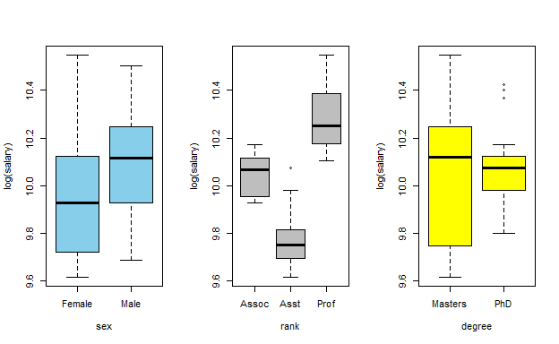

<p class="caption">

<span id="fig:unnamed-chunk-1"></span>Figura 5.1: Gráficos de caja de
los tres factores

</p>

</div>

Las cajas del primer gráfico se traslapan, por lo que si no se tomaran
en cuentan todas las covariables restantes entonces tal vez el salario
sería igual para hambos sexos, aunque la variabilidad es mayor cuando
*sex=female*. Para los rangos más altos el salario es mayor, y la
variabilidad también crece. En cuanto al grado del profesor, cuando es
maestro la variabilidad es mucho mayor que con el grado de doctor.

Se crea el gráfico del salario contra los años que lleva en el rango
actual dado el sexo, y también el gráfico del salario contra años los
que lleva desde el grado superior dado el sexo, éstos están dados en las
Figuras 5.2 y 5.3 respectivamente.

``` r
> library(lattice)
> xyplot(log(salary)~year|sex, data=sal, type=c("p", "g", "r"),
+        col=c('red', 'red'), xlab = 'Años en el rango actual',
+        ylab = 'log(salario)', pch=16)
```

<div class="figure">

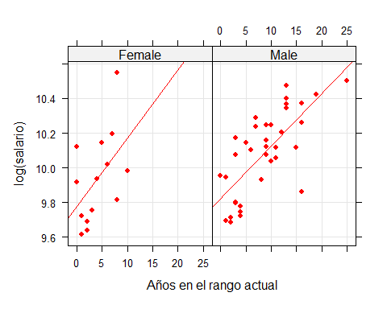

<p class="caption">

<span id="fig:unnamed-chunk-2"></span>Figura 5.2: log(salario) contra
años en rango actual dado el sexo

</p>

</div>

``` r
> xyplot(log(salary)~ysdeg|sex, data=sal, type=c("p", "g", "r"), col=c('blue', 'blue'),
+        xlab = 'Años desde el grado superior', ylab = 'log(salario)', pch=16)
```

<div class="figure">

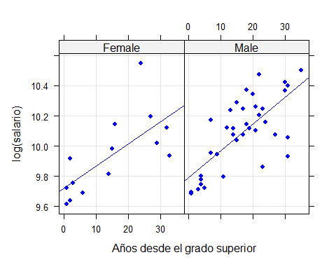

<p class="caption">

<span id="fig:unnamed-chunk-3"></span>Figura 5.3: log(salario) contra
años desde el grado superior dado el sexo

</p>

</div>

Las líneas de tendencia indican que la tasa de incremento en el salario
para los hombres es mayor que la de las mujeres conforme pasan los años
en el grado superior, pero lo contrario ocurre con el paso de los años
en el rango actual. Debido a la dispersión de los datos, las rectas de
los gráficos no parecen plausibles.

## 5.7 Ajuste de Modelos

Para incluir factores en la regresión se utilizan las variables dummy
$d_i$ que se definen de la siguiente forma,

$$\begin{align*}d_1 & = 
\begin{cases}
1, &  \mbox{sex=female} \\
0, &  \mbox{sex=male}
\end{cases} \\
d_2 & = 
\begin{cases}
1, & \mbox{degree=PhD} \\
0, & \mbox{degree=Masters}
\end{cases} \\
d_3 & = 
\begin{cases}
1, & \mbox{rank=Assoc} \\
0, & \text{d.o.f.}
\end{cases}\\ 
d_4& = 
\begin{cases}
1, & \mbox{rank=Prof} \\
0, & \text{d.o.f.}
\end{cases} 
\end{align*}$$

además, $years.deg$ = años desde el grado superior y $years.rank=$ años
en rango actual.

Dado que $d_1=1$ si *sex=female*, y si el factor no tiene interacciones
con las otras covariables, entonces el coefiente de regresión $\beta_1$
es igual a la a la diferencia los promedios del log(salario) de una
mujer con el log(salario) de un hombre que tienen las mismas
características en cuanto a las otras covariables del modelo. Es decir,

$$E(y|(x_2, x_3,\ldots, x_k), ~d_1=1)- E(y|(x_2, x_3,\ldots, x_k), ~d_1=0)=\beta_1.$$

Si $\beta_1$ es significativo y negativo, entonces las mujeres sí sufren
discriminación salarial. En todos los modelos ajustados los intervalos
de credibilidad serán del 95%.

En R, se especifican estas variables,

``` r
> y<-log(sal$salary)
> n<-length(sex)
> d1<-model.matrix(~-1+sex)[,1]
> d2<-model.matrix(~-1+degree)[,2]
> d3<-model.matrix(~-1+rank)[,1] 
> d4<-model.matrix(~-1+rank)[,3]
> years.rank = sal$year
> years.deg = ysdeg
```

### 5.7.1 Modelo Inicial

El primer modelo que se ajusta es el más general, donde se consideran
interacciones, este es el modelo (1).

$$\begin{align*} \tag{1}
E(y|x) & = \beta_0+ \beta_1d_1 + \beta_2 d_1d_2 + \beta_3 d_1d_3 + \beta_4 d_1d_4 + \beta_5 d_1 \times years.deg \\
& +  \beta_6d_1  \times years.rank + \beta_7 d_2  +  \beta_8 d_3+ \beta_9d_4 + \beta_{10} years.deg + \beta_{11}d_2  \times years.deg+ \beta_{12}years.rank
\end{align*}$$

El código para obtener cadena de Markov se presenta en el anexo.

``` r
> mod.gen1 = read.table("mod.gen.txt")  # (Cadena de Markov)
> i = seq(1, nrow(mod.gen1), by=3) # Thinning
> quantiles95<-function(x) quantile(x, probs=c(0.025, 0.975))
> means.theta<-apply(mod.gen1[i, ], MARGIN = 2, mean)
> names(means.theta) <- c('Intercepto', 'd1', 'd1d2',  'd1d3', 'd1d4', 'd1*years.deg',
+                         'd1*years.rank', 'd2', 'd3', 'd4', 'years.deg', 'd2*years.deg',
+                         'years.rank'  , 'sigma2')
```

Las estimaciones de los coeficientes de regresión y la varianza se
presentan en las dos tablas de abajo.

``` r
> round(t(as.matrix(means.theta[ 1:7])), 5)
```

| Intercepto |       d1 |     d1d2 |     d1d3 |    d1d4 | d1\*years.deg | d1\*years.rank |
|-----------:|---------:|---------:|---------:|--------:|--------------:|---------------:|
|    9.70197 | -0.01619 | -0.01927 | -0.04942 | 0.01152 |       0.00305 |         0.0045 |

``` r
> round(t(as.matrix(means.theta[ 8:14])), 5)
```

|      d2 |      d3 |      d4 | years.deg | d2\*years.deg | years.rank |  sigma2 |
|--------:|--------:|--------:|----------:|--------------:|-----------:|--------:|
| 0.15666 | 0.24431 | 0.45318 |  -0.00323 |      -0.00462 |    0.01733 | 0.00889 |

Y los intervalos de credibilidad del 95% están dados por las dos tablas
siguientes.

``` r
> int.cred<-apply(mod.gen1[i, ], MARGIN = 2, quantiles95)
> colnames(int.cred) <- c('Intercepto', 'd1', 'd1d2',  'd1d3', 'd1d4', 'd1years.deg', 'd1years.rank', 'd2', 'd3', 'd4', 'years.deg', 'd2years.deg', 'years.rank'  , 'sigma2') 
> round(int.cred[, 1:7], 5)
```

|       | Intercepto |       d1 |     d1d2 |     d1d3 |     d1d4 | d1years.deg | d1years.rank |
|-------|-----------:|---------:|---------:|---------:|---------:|------------:|-------------:|
| 2.5%  |    9.62779 | -0.13533 | -0.24605 | -0.38118 | -0.29770 |    -0.01414 |     -0.01729 |
| 97.5% |    9.77509 |  0.10351 |  0.20879 |  0.28052 |  0.32024 |     0.02037 |      0.02648 |

``` r
> round(int.cred[, 8:14], 5)
```

|       |       d2 |      d3 |      d4 | years.deg | d2years.deg | years.rank |  sigma2 |
|-------|---------:|--------:|--------:|----------:|------------:|-----------:|--------:|
| 2.5%  | -0.00504 | 0.14459 | 0.32759 |  -0.01309 |    -0.01306 |    0.00746 | 0.00566 |
| 97.5% |  0.31830 | 0.34278 | 0.57845 |   0.00668 |     0.00382 |    0.02715 | 0.01387 |

Notemos que todos los intervalos para coeficientes donde $d_1$ está
involucrado contienen al 0. Observando los intervalos podemos concluir
que variable que no sea un nivel de rango o los años en el rango actual
debería eliminarse.

Las autocorrelaciones de $\sigma^2$ y su grafica de “Running Means”
están dadas en la Figura 5.4.

<div class="figure">

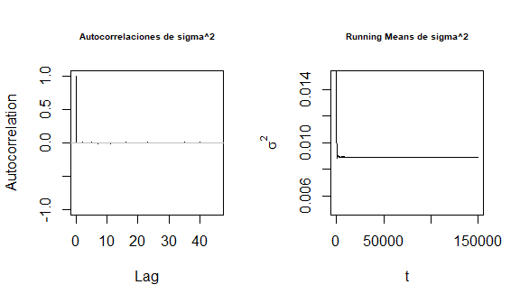

<p class="caption">

<span id="fig:autoRun"></span>Figura 5.4: Autocorrelaciones y Running
Means de sigma^2 para el modelo (1)

</p>

</div>

### 5.7.2 Segundo Modelo

Dado que el factor grado de estudios y los años desde el grado superior
pueden ser importantes, porque reflejan la experiencia, se ajusta el
modelo (2).

$$\begin{equation} \tag{2} E(y|x)=\beta_0+\beta_1d_1+ \beta_2d_2+ \beta_3d_3+\beta_4d_4+\beta_5years.deg+\beta_6years.rank+\beta_7 d1 \times years.deg + \beta_8 d1 \times years.rank
\end{equation}$$

Las estimaciones de los coeficientes de regresión y varianza se dan a
continuación.

| Intercepto |       d1 |     d2 |      d3 |      d4 | years.deg | years.rank | d1years.deg | d1years.rank |  sigma2 |
|-----------:|---------:|-------:|--------:|--------:|----------:|-----------:|------------:|-------------:|--------:|
|    9.71946 | -0.03057 | 0.0777 | 0.25892 | 0.49095 |  -0.00674 |    0.01879 |     0.00207 |      0.00971 | 0.00853 |

Y los intervalos de credibilidad del 95% de los parámetros se encuentran
en la tabla de abajo.

|       | Intercepto |      d1 |      d2 |     d3 |     d4 | years.deg | years.rank | d1years.deg | d1years.rank | sigma2 |
|-------|-----------:|--------:|--------:|-------:|-------:|----------:|-----------:|------------:|-------------:|-------:|
| 2.5%  |     9.6533 | -0.1413 | -0.0006 | 0.1717 | 0.3874 |   -0.0138 |     0.0100 |     -0.0047 |      -0.0092 | 0.0055 |
| 97.5% |     9.7857 |  0.0806 |  0.1554 | 0.3463 | 0.5942 |    0.0004 |     0.0276 |      0.0088 |       0.0286 | 0.0131 |

$\beta_1$ resultó no significativo con un nivel del 95%.

El grado de estudios, el número años que lleva en ese grado, la
interacción del factor sexo con tanto los años en el rango actual como
con los años en ese grado superior, son no significativos, por lo que se
confirma que las Figuras 5.2 y 5.3 no son plausibles, y la variable
$d_1$ tampoco es significativa.

Las autocorrelaciones de $\sigma^2$ y su grafica de “Running Means”
están en la Figura 5.5.

<div class="figure">

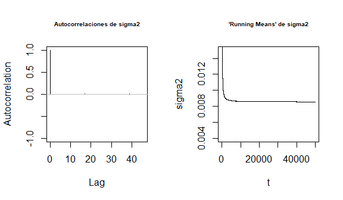

<p class="caption">

<span id="fig:unnamed-chunk-13"></span>Figura 5.5: Autocorrelaciones y
Running Means de sigma2 para el modelo (2)

</p>

</div>

### 5.7.3 Tercer Modelo

Ahora, se ajusta el modelo sin utilizar el factor grado de estudios y
sus interacciones, y tampoco los años en el grado superior, dicho modelo
es el (3).

$$\begin{equation} \tag{3} E(y|x)=\beta_0+\beta_1d_1+  \beta_2d_3+\beta_3d_4+\beta_5years.rank \end{equation}$$

Las estimaciones de los coeficientes de regresión y la varianza se dan a
continuación.

| Intercepto |      d1 |      d3 |      d4 | years.rank |  sigma2 |
|-----------:|--------:|--------:|--------:|-----------:|--------:|
|    9.70896 | 0.01401 | 0.22756 | 0.41577 |    0.01516 | 0.00903 |

Y los intervalos de credibilidad del 95% de los parámetros están dados
en la siguiente tabla.

|       | Intercepto |       d1 |      d3 |      d4 | years.rank |  sigma2 |
|-------|-----------:|---------:|--------:|--------:|-----------:|--------:|
| 2.5%  |    9.64777 | -0.05048 | 0.15753 | 0.34508 |    0.00935 | 0.00600 |
| 97.5% |    9.77022 |  0.07849 | 0.29731 | 0.48655 |    0.02099 | 0.01356 |

Al igual que en el segundo modelo, el coeficiente de regresión resultó
no ser significativo porque su intervalo de credibilidad contiene a 0,
entonces con un 95% de confianza se afirma que las mujeres no son sufren
discriminación salarial.

Las autocorrelaciones de $\sigma^2$ y su grafica de “Running Means” se
encuentran en la Figura 5.6.

<div class="figure">

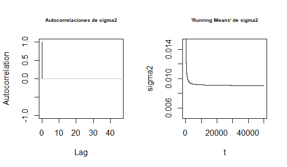

<p class="caption">

<span id="fig:unnamed-chunk-19"></span>Figura 5.6: Autocorrelaciones y
Running Means de sigma2 para modelo (3)

</p>

</div>

### 5.7.4 Cuarto Modelo

Finkelstein (1980), en una discusión sobre el uso de regresión en casos
de discriminación, escribe que “esa variable puede reflejar una posición
o estatus otorgado por el empleador, en cuyo caso si hay discriminación
en la adjudicación del puesto o estatus, la variable puede estar
‘contaminada’”. Entonces, si existe discriminación al asignar rangos más
altos, usar el rango para ajustar los salarios puede no ser aceptable
para los tribunales. Por lo que se ajustará un modelo sin tomar la
variable *rank*, pero sí se utiliza *years.rank*,

Las estimaciones de los coeficientes de regresión y la varianza se
muestran abajo.

| Intercepto |       d1 |       d2 | years.deg | years.rank |  sigma2 |
|-----------:|---------:|---------:|----------:|-----------:|--------:|
|    9.77143 | -0.07411 | -0.12284 |   0.01524 |     0.0124 | 0.02485 |

Y los intervalos de credibilidad correspondientes se muestran a
continuación.

|       | Intercepto |       d1 |       d2 | years.deg | years.rank |  sigma2 |
|-------|-----------:|---------:|---------:|----------:|-----------:|--------:|
| 2.5%  |    9.67598 | -0.18262 | -0.23009 |   0.00855 |    0.00058 | 0.01650 |
| 97.5% |    9.86630 |  0.03467 | -0.01430 |   0.02190 |    0.02417 | 0.03725 |

El intervalo de credibilidad para $\beta_1$ contiene a 0, por lo que que
con un 95% de confianza se rechaza que exista discriminación salarial
hacia las mujeres. Los demás parámetros son significativos.

Y las autocorrelaciones son insignificantes para cualquier rezago, y
están dadas en la Figura 5.7 junto con la gráfica de “Running Means”,

<div class="figure">

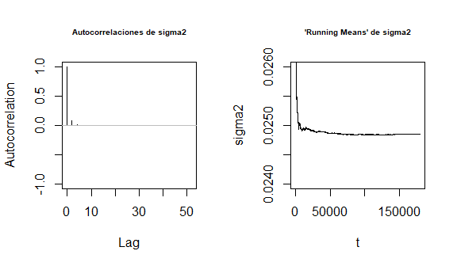

<p class="caption">

<span id="fig:unnamed-chunk-25"></span>Figura 5.7: Autocorrelaciones y
Running Means de sigma2 para el modelo (4)

</p>

</div>

    ## Autocorrelación a rezago 2: 
    ##                  0.08613458

# 6 CONCLUSIONES

En este trabajo, para todos los modelos ajustados, el factor sexo no
tuvo interacciones con otras variables, por lo que la interpretación de
éste es menos complicada, además de que con un 95% de confianza, en
todos los modelos se rechazó la existencia de una disriminación salarial
contra las mujeres en la universidad.

El rango resultó ser el factor que mejor determina el salario de los
profesores, algo que en los gráficos de cajas se anticipó.

# 7 REFERENCIAS BIBLIOGRÁFICAS

1.  Schultz, T. W. (1961). Investment in Human Capital. *American
    Economic Review*. 51(1), 1-17.

2.  *Sex-Based Discrimination*, Recuperado el 18 de junio de 2022, de
    <https://www.eeoc.gov/sex-based-discrimination>

3.  Weisberg, S. (2013). Applied Linear Regression ($4^a$ ed.).
    St. Paul, Minnesota. Jhon Wiley & Sons. p. 130

4.  Finkelstein, M. O. (1980). The judicial reception of multiple
    regression studies in race and sex discrimination cases. Columbia
    Law Review.

# 8 ANEXO

## 8.1 Cadena de Markov

Para obtener las cadenas de Markov se utiliza el siguiente código, donde
solo se tienen que cambiar las covariables para ajustar diferentes
modelos.

``` r
> n = length(y)
> d1d2<-d1*d2
> d1d3<-d1*d3
> d1d4<-d1*d4
> years.degd1 =  years.deg*d1
> years.rankd1 = years.rank*d1
> years.degd2 =  years.deg*d2
> years.rankd3 = years.rank*d3
> years.rankd4 = years.rank*d4
```

``` r
> X<-cbind(rep(1, n), d1, d1d2,  d1d3, d1d4, years.degd1,
+          years.rankd1, d2, d3, d4, years.deg, years.degd2, years.rank)
> 
> beta.hat <- solve(t(X)%*%X)%*%t(X)%*%y
> 
> XtX = t(X)%*%X
> iXtX = solve(XtX)
> L.star = (eigen(iXtX)$vectors)%*%diag(sqrt(eigen(iXtX)$values))   
> iL.star = solve(L.star)
> sigma2.ols = 0.02; theta = matrix(c(beta.hat, sigma2.ols), ncol = length(beta.hat)+1)
> 
> size = 150000
> for (i in 1:size) {
+   L  =  sqrt(theta[nrow(theta), ncol(theta)])*L.star              
+   iL = 1/sqrt(theta[nrow(theta), ncol(theta)])*iL.star 
+   MU.t = iL%*%beta.hat                         
+   Y = c(rnorm(length(MU.t), mean = MU.t))
+   thetan<-t(L%*%Y)
+   w = rchisq(n=1, df=n)
+   sigma2n = t(y-X%*%c(theta[nrow(theta), 1:length(beta.hat)]))%*%(y-X%*%c(theta[nrow(theta), 1:length(beta.hat)]))/w
+   theta = rbind(theta, c(thetan, sigma2n))
+   if (i%%(size/20)==0) cat(' completado ', (i/size)*100, '%', sep = "")
+ }
```

La cadena se guarda en un archivo txt.

``` r
> mod.gen = write.table(theta,
+                       file = "mod.gen.txt",
+                             col.names = FALSE, row.names = FALSE)
```

## 8.2 Código Para Autocorrelaciones y ‘Running Means’ de $\sigma^2$

``` r
> par(mfrow=c(1,2))
> autocorr.plot(as.mcmc(as.vector(mod.gen1[i, 14])),
+               auto.layout = FALSE, cex.main=.6, main = "Autocorrelaciones de sigma^2")
> abline(h=0, col="gray")
> plot(1:length(mod.gen1[, 14]),
+      cumsum(mod.gen1[, 14])/1:length(mod.gen1[, 14]),
+      type = 'l',
+      ylab = expression(sigma^2), xlab = 't', main = "Running Means de sigma^2",
+      cex.main=0.6, ylim = c(0.005, 0.015))
```

## 8.3 Autocorrelaciones y ‘Running Means’ de $\beta_1$

<div class="figure">

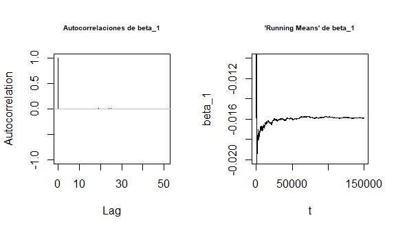

<p class="caption">

<span id="fig:unnamed-chunk-30"></span>Figura 8.1: Autocorrelaciones y
Running Means de beta_1 para el modelo (1)

</p>

</div>

<div class="figure">

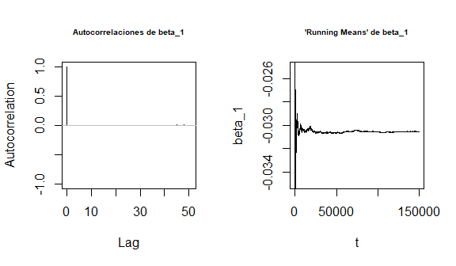

<p class="caption">

<span id="fig:unnamed-chunk-31"></span>Figura 8.2: Autocorrelaciones y
Running Means de beta_1 para el modelo (2)

</p>

</div>

<div class="figure">

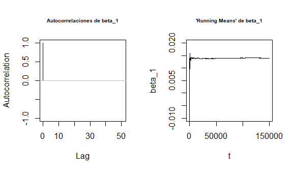

<p class="caption">

<span id="fig:unnamed-chunk-32"></span>Figura 8.3: Autocorrelaciones y
Running Means de beta_1 para el modelo (3)

</p>

</div>

<div class="figure">

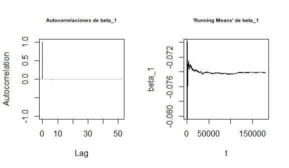

<p class="caption">

<span id="fig:unnamed-chunk-33"></span>Figura 8.4: Autocorrelaciones y
Running Means de beta_1 para el modelo (4)

</p>

</div>
